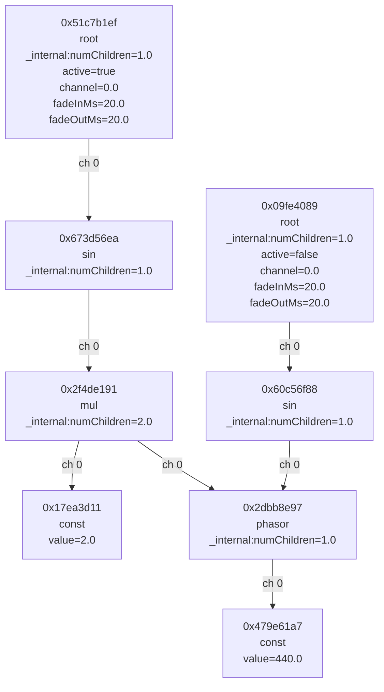

```mermaid
flowchart TD
    n0x09fe4089["0x09fe4089<br/>root<br/>_internal:numChildren=1.0<br/>active=false<br/>channel=0.0<br/>fadeInMs=20.0<br/>fadeOutMs=20.0"]
    n0x17ea3d11["0x17ea3d11<br/>const<br/>value=2.0"]
    n0x2dbb8e97["0x2dbb8e97<br/>phasor<br/>_internal:numChildren=1.0"]
    n0x2f4de191["0x2f4de191<br/>mul<br/>_internal:numChildren=2.0"]
    n0x479e61a7["0x479e61a7<br/>const<br/>value=440.0"]
    n0x51c7b1ef["0x51c7b1ef<br/>root<br/>_internal:numChildren=1.0<br/>active=true<br/>channel=0.0<br/>fadeInMs=20.0<br/>fadeOutMs=20.0"]
    n0x60c56f88["0x60c56f88<br/>sin<br/>_internal:numChildren=1.0"]
    n0x673d56ea["0x673d56ea<br/>sin<br/>_internal:numChildren=1.0"]
    n0x09fe4089 -->|ch 0| n0x60c56f88
    n0x2dbb8e97 -->|ch 0| n0x479e61a7
    n0x2f4de191 -->|ch 0| n0x17ea3d11
    n0x2f4de191 -->|ch 0| n0x2dbb8e97
    n0x51c7b1ef -->|ch 0| n0x673d56ea
    n0x60c56f88 -->|ch 0| n0x2dbb8e97
    n0x673d56ea -->|ch 0| n0x2f4de191
```
