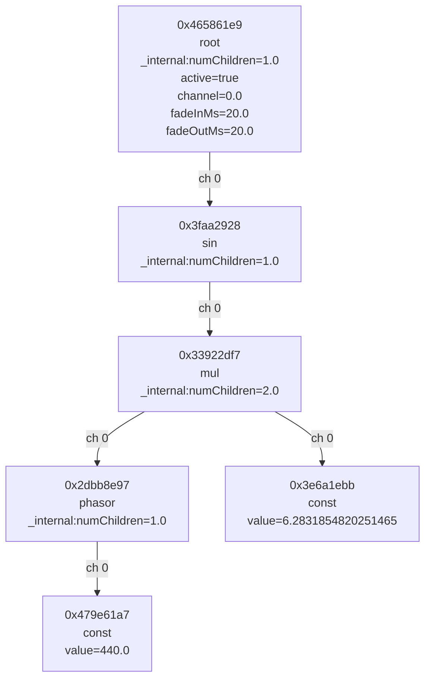

```mermaid
flowchart TD
    n0x2dbb8e97["0x2dbb8e97<br/>phasor<br/>_internal:numChildren=1.0"]
    n0x33922df7["0x33922df7<br/>mul<br/>_internal:numChildren=2.0"]
    n0x3e6a1ebb["0x3e6a1ebb<br/>const<br/>value=6.2831854820251465"]
    n0x3faa2928["0x3faa2928<br/>sin<br/>_internal:numChildren=1.0"]
    n0x465861e9["0x465861e9<br/>root<br/>_internal:numChildren=1.0<br/>active=true<br/>channel=0.0<br/>fadeInMs=20.0<br/>fadeOutMs=20.0"]
    n0x479e61a7["0x479e61a7<br/>const<br/>value=440.0"]
    n0x2dbb8e97 -->|ch 0| n0x479e61a7
    n0x33922df7 -->|ch 0| n0x3e6a1ebb
    n0x33922df7 -->|ch 0| n0x2dbb8e97
    n0x3faa2928 -->|ch 0| n0x33922df7
    n0x465861e9 -->|ch 0| n0x3faa2928
```
