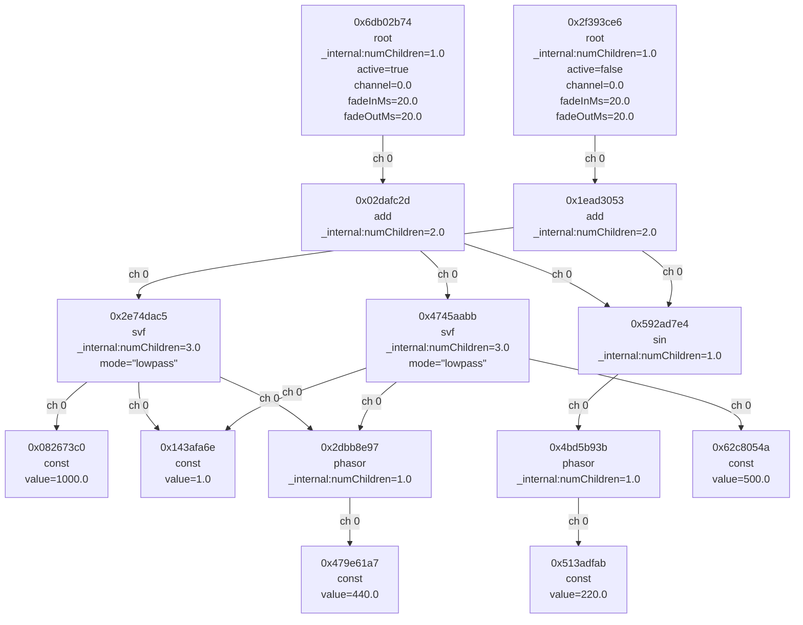

```mermaid
flowchart TD
    n0x02dafc2d["0x02dafc2d<br/>add<br/>_internal:numChildren=2.0"]
    n0x082673c0["0x082673c0<br/>const<br/>value=1000.0"]
    n0x143afa6e["0x143afa6e<br/>const<br/>value=1.0"]
    n0x1ead3053["0x1ead3053<br/>add<br/>_internal:numChildren=2.0"]
    n0x2dbb8e97["0x2dbb8e97<br/>phasor<br/>_internal:numChildren=1.0"]
    n0x2e74dac5["0x2e74dac5<br/>svf<br/>_internal:numChildren=3.0<br/>mode=#quot;lowpass#quot;"]
    n0x2f393ce6["0x2f393ce6<br/>root<br/>_internal:numChildren=1.0<br/>active=false<br/>channel=0.0<br/>fadeInMs=20.0<br/>fadeOutMs=20.0"]
    n0x4745aabb["0x4745aabb<br/>svf<br/>_internal:numChildren=3.0<br/>mode=#quot;lowpass#quot;"]
    n0x479e61a7["0x479e61a7<br/>const<br/>value=440.0"]
    n0x4bd5b93b["0x4bd5b93b<br/>phasor<br/>_internal:numChildren=1.0"]
    n0x513adfab["0x513adfab<br/>const<br/>value=220.0"]
    n0x592ad7e4["0x592ad7e4<br/>sin<br/>_internal:numChildren=1.0"]
    n0x62c8054a["0x62c8054a<br/>const<br/>value=500.0"]
    n0x6db02b74["0x6db02b74<br/>root<br/>_internal:numChildren=1.0<br/>active=true<br/>channel=0.0<br/>fadeInMs=20.0<br/>fadeOutMs=20.0"]
    n0x02dafc2d -->|ch 0| n0x4745aabb
    n0x02dafc2d -->|ch 0| n0x592ad7e4
    n0x1ead3053 -->|ch 0| n0x2e74dac5
    n0x1ead3053 -->|ch 0| n0x592ad7e4
    n0x2dbb8e97 -->|ch 0| n0x479e61a7
    n0x2e74dac5 -->|ch 0| n0x082673c0
    n0x2e74dac5 -->|ch 0| n0x143afa6e
    n0x2e74dac5 -->|ch 0| n0x2dbb8e97
    n0x2f393ce6 -->|ch 0| n0x1ead3053
    n0x4745aabb -->|ch 0| n0x62c8054a
    n0x4745aabb -->|ch 0| n0x143afa6e
    n0x4745aabb -->|ch 0| n0x2dbb8e97
    n0x4bd5b93b -->|ch 0| n0x513adfab
    n0x592ad7e4 -->|ch 0| n0x4bd5b93b
    n0x6db02b74 -->|ch 0| n0x02dafc2d
```
