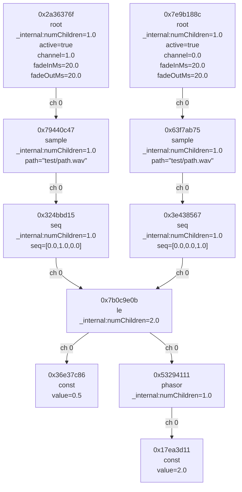

```mermaid
flowchart TD
    n0x17ea3d11["0x17ea3d11<br/>const<br/>value=2.0"]
    n0x2a36376f["0x2a36376f<br/>root<br/>_internal:numChildren=1.0<br/>active=true<br/>channel=1.0<br/>fadeInMs=20.0<br/>fadeOutMs=20.0"]
    n0x324bbd15["0x324bbd15<br/>seq<br/>_internal:numChildren=1.0<br/>seq=[0.0,1.0,0.0]"]
    n0x36e37c86["0x36e37c86<br/>const<br/>value=0.5"]
    n0x3e438567["0x3e438567<br/>seq<br/>_internal:numChildren=1.0<br/>seq=[0.0,0.0,1.0]"]
    n0x53294111["0x53294111<br/>phasor<br/>_internal:numChildren=1.0"]
    n0x63f7ab75["0x63f7ab75<br/>sample<br/>_internal:numChildren=1.0<br/>path=#quot;test/path.wav#quot;"]
    n0x79440c47["0x79440c47<br/>sample<br/>_internal:numChildren=1.0<br/>path=#quot;test/path.wav#quot;"]
    n0x7b0c9e0b["0x7b0c9e0b<br/>le<br/>_internal:numChildren=2.0"]
    n0x7e9b188c["0x7e9b188c<br/>root<br/>_internal:numChildren=1.0<br/>active=true<br/>channel=0.0<br/>fadeInMs=20.0<br/>fadeOutMs=20.0"]
    n0x2a36376f -->|ch 0| n0x79440c47
    n0x324bbd15 -->|ch 0| n0x7b0c9e0b
    n0x3e438567 -->|ch 0| n0x7b0c9e0b
    n0x53294111 -->|ch 0| n0x17ea3d11
    n0x63f7ab75 -->|ch 0| n0x3e438567
    n0x79440c47 -->|ch 0| n0x324bbd15
    n0x7b0c9e0b -->|ch 0| n0x53294111
    n0x7b0c9e0b -->|ch 0| n0x36e37c86
    n0x7e9b188c -->|ch 0| n0x63f7ab75
```
