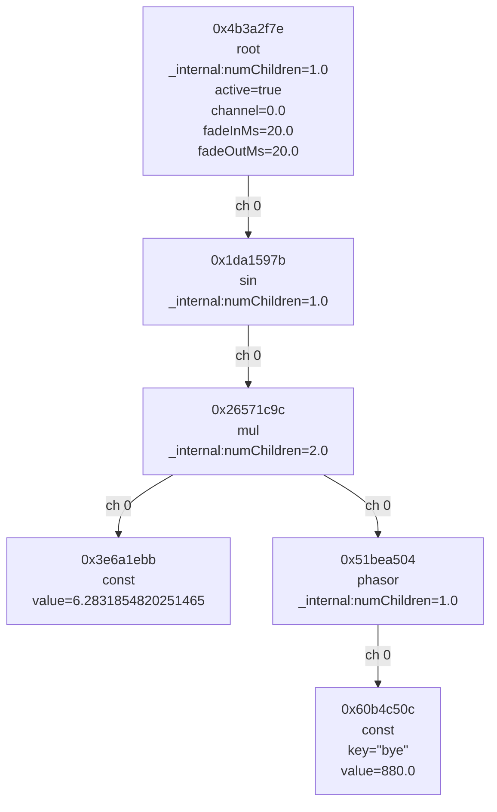

```mermaid
flowchart TD
    n0x1da1597b["0x1da1597b<br/>sin<br/>_internal:numChildren=1.0"]
    n0x26571c9c["0x26571c9c<br/>mul<br/>_internal:numChildren=2.0"]
    n0x3e6a1ebb["0x3e6a1ebb<br/>const<br/>value=6.2831854820251465"]
    n0x4b3a2f7e["0x4b3a2f7e<br/>root<br/>_internal:numChildren=1.0<br/>active=true<br/>channel=0.0<br/>fadeInMs=20.0<br/>fadeOutMs=20.0"]
    n0x51bea504["0x51bea504<br/>phasor<br/>_internal:numChildren=1.0"]
    n0x60b4c50c["0x60b4c50c<br/>const<br/>key=#quot;bye#quot;<br/>value=880.0"]
    n0x1da1597b -->|ch 0| n0x26571c9c
    n0x26571c9c -->|ch 0| n0x3e6a1ebb
    n0x26571c9c -->|ch 0| n0x51bea504
    n0x4b3a2f7e -->|ch 0| n0x1da1597b
    n0x51bea504 -->|ch 0| n0x60b4c50c
```
