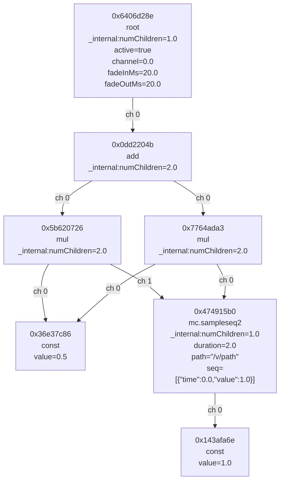

```mermaid
flowchart TD
    n0x0dd2204b["0x0dd2204b<br/>add<br/>_internal:numChildren=2.0"]
    n0x143afa6e["0x143afa6e<br/>const<br/>value=1.0"]
    n0x36e37c86["0x36e37c86<br/>const<br/>value=0.5"]
    n0x474915b0["0x474915b0<br/>mc.sampleseq2<br/>_internal:numChildren=1.0<br/>duration=2.0<br/>path=#quot;/v/path#quot;<br/>seq=[{#quot;time#quot;:0.0,#quot;value#quot;:1.0}]"]
    n0x5b620726["0x5b620726<br/>mul<br/>_internal:numChildren=2.0"]
    n0x6406d28e["0x6406d28e<br/>root<br/>_internal:numChildren=1.0<br/>active=true<br/>channel=0.0<br/>fadeInMs=20.0<br/>fadeOutMs=20.0"]
    n0x7764ada3["0x7764ada3<br/>mul<br/>_internal:numChildren=2.0"]
    n0x0dd2204b -->|ch 0| n0x7764ada3
    n0x0dd2204b -->|ch 0| n0x5b620726
    n0x474915b0 -->|ch 0| n0x143afa6e
    n0x5b620726 -->|ch 0| n0x36e37c86
    n0x5b620726 -->|ch 1| n0x474915b0
    n0x6406d28e -->|ch 0| n0x0dd2204b
    n0x7764ada3 -->|ch 0| n0x36e37c86
    n0x7764ada3 -->|ch 0| n0x474915b0
```
