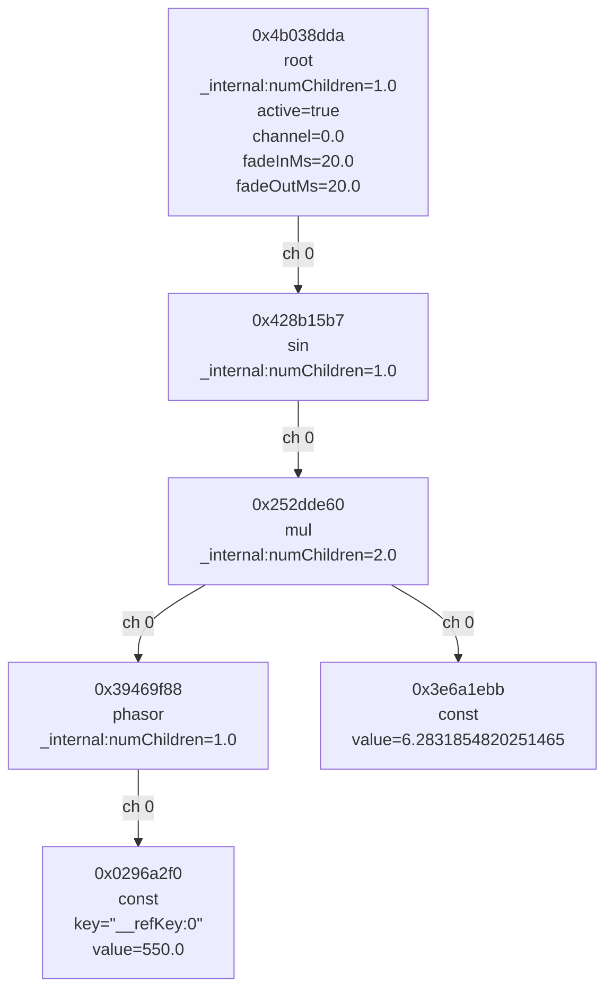

```mermaid
flowchart TD
    n0x0296a2f0["0x0296a2f0<br/>const<br/>key=#quot;__refKey:0#quot;<br/>value=550.0"]
    n0x252dde60["0x252dde60<br/>mul<br/>_internal:numChildren=2.0"]
    n0x39469f88["0x39469f88<br/>phasor<br/>_internal:numChildren=1.0"]
    n0x3e6a1ebb["0x3e6a1ebb<br/>const<br/>value=6.2831854820251465"]
    n0x428b15b7["0x428b15b7<br/>sin<br/>_internal:numChildren=1.0"]
    n0x4b038dda["0x4b038dda<br/>root<br/>_internal:numChildren=1.0<br/>active=true<br/>channel=0.0<br/>fadeInMs=20.0<br/>fadeOutMs=20.0"]
    n0x252dde60 -->|ch 0| n0x3e6a1ebb
    n0x252dde60 -->|ch 0| n0x39469f88
    n0x39469f88 -->|ch 0| n0x0296a2f0
    n0x428b15b7 -->|ch 0| n0x252dde60
    n0x4b038dda -->|ch 0| n0x428b15b7
```
