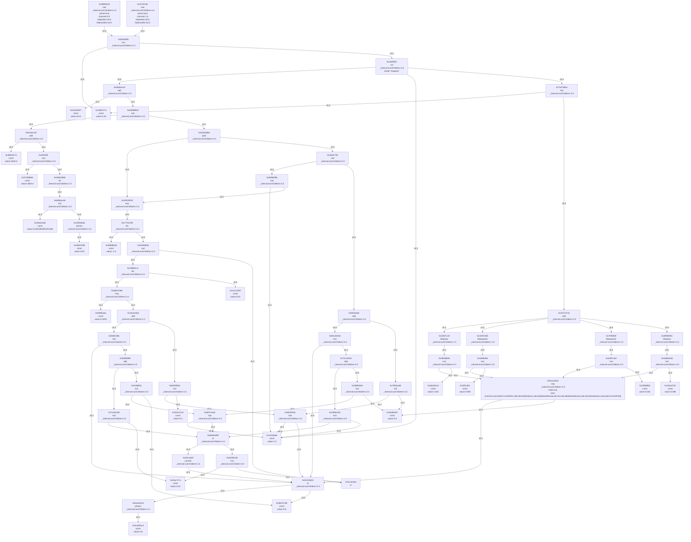

```mermaid
flowchart TD
    n0x05bfc38b["0x05bfc38b<br/>mul<br/>_internal:numChildren=2.0"]
    n0x0845ee19["0x0845ee19<br/>add<br/>_internal:numChildren=2.0"]
    n0x0aad11b3["0x0aad11b3<br/>phasor<br/>_internal:numChildren=1.0"]
    n0x0cf0df3d["0x0cf0df3d<br/>mul<br/>_internal:numChildren=2.0"]
    n0x0d0b5f96["0x0d0b5f96<br/>sub<br/>_internal:numChildren=2.0"]
    n0x103a4752["0x103a4752<br/>const<br/>value=0.496"]
    n0x143afa6e["0x143afa6e<br/>const<br/>value=1.0"]
    n0x1597c605["0x1597c605<br/>blepsquare<br/>_internal:numChildren=1.0"]
    n0x17751439["0x17751439<br/>div<br/>_internal:numChildren=2.0"]
    n0x18a34a0d["0x18a34a0d<br/>add<br/>_internal:numChildren=2.0"]
    n0x18d07c7c["0x18d07c7c<br/>const<br/>value=0.25"]
    n0x1a1c2d33["0x1a1c2d33<br/>const<br/>value=6.91"]
    n0x1ebff391["0x1ebff391<br/>svf<br/>_internal:numChildren=3.0<br/>mode=#quot;lowpass#quot;"]
    n0x1f2b7c19["0x1f2b7c19<br/>blepsaw<br/>_internal:numChildren=1.0"]
    n0x1ff1cd61["0x1ff1cd61<br/>const<br/>value=0.994"]
    n0x238b51c1["0x238b51c1<br/>div<br/>_internal:numChildren=2.0"]
    n0x239bf85b["0x239bf85b<br/>const<br/>value=0.501"]
    n0x2495d4de["0x2495d4de<br/>phasor<br/>_internal:numChildren=1.0"]
    n0x288f351d["0x288f351d<br/>root<br/>_internal:numChildren=1.0<br/>active=true<br/>channel=0.0<br/>fadeInMs=20.0<br/>fadeOutMs=20.0"]
    n0x29936b00["0x29936b00<br/>mul<br/>_internal:numChildren=2.0"]
    n0x2dccdaf4["0x2dccdaf4<br/>counter<br/>_internal:numChildren=1.0"]
    n0x2e058ba6["0x2e058ba6<br/>mul<br/>_internal:numChildren=2.0"]
    n0x32d83d47["0x32d83d47<br/>const<br/>value=0.0"]
    n0x32e137a3["0x32e137a3<br/>const<br/>value=0.4"]
    n0x339b21b4["0x339b21b4<br/>mul<br/>_internal:numChildren=2.0"]
    n0x348f4d5e["0x348f4d5e<br/>mul<br/>_internal:numChildren=2.0"]
    n0x36e37c86["0x36e37c86<br/>const<br/>value=0.5"]
    n0x37187afc["0x37187afc<br/>root<br/>_internal:numChildren=1.0<br/>active=true<br/>channel=1.0<br/>fadeInMs=20.0<br/>fadeOutMs=20.0"]
    n0x389c5e74["0x389c5e74<br/>const<br/>value=1840.0"]
    n0x38b88ead["0x38b88ead<br/>const<br/>value=-1.0"]
    n0x3999e90c["0x3999e90c<br/>blepsaw<br/>_internal:numChildren=1.0"]
    n0x3ca59a13["0x3ca59a13<br/>const<br/>value=4.8"]
    n0x3cc3c6a4["0x3cc3c6a4<br/>sr"]
    n0x3e6a1ebb["0x3e6a1ebb<br/>const<br/>value=6.2831854820251465"]
    n0x3f962b08["0x3f962b08<br/>mul<br/>_internal:numChildren=2.0"]
    n0x4161b937["0x4161b937<br/>const<br/>value=40.0"]
    n0x42373723["0x42373723<br/>add<br/>_internal:numChildren=4.0"]
    n0x42f67ac8["0x42f67ac8<br/>mul<br/>_internal:numChildren=2.0"]
    n0x43019005["0x43019005<br/>exp<br/>_internal:numChildren=1.0"]
    n0x43ac7c7a["0x43ac7c7a<br/>const<br/>value=0.01"]
    n0x43b576d6["0x43b576d6<br/>const<br/>value=0.05"]
    n0x43f22ffc["0x43f22ffc<br/>mul<br/>_internal:numChildren=2.0"]
    n0x44b82e5d["0x44b82e5d<br/>mul<br/>_internal:numChildren=2.0"]
    n0x45af1755["0x45af1755<br/>mul<br/>_internal:numChildren=2.0"]
    n0x45b2086d["0x45b2086d<br/>sin<br/>_internal:numChildren=1.0"]
    n0x47308848["0x47308848<br/>const<br/>value=1800.0"]
    n0x4823f33a["0x4823f33a<br/>sub<br/>_internal:numChildren=2.0"]
    n0x4be50ce3["0x4be50ce3<br/>const<br/>value=1.001"]
    n0x4d23bc0b["0x4d23bc0b<br/>mul<br/>_internal:numChildren=2.0"]
    n0x50689604["0x50689604<br/>mul<br/>_internal:numChildren=2.0"]
    n0x506909fd["0x506909fd<br/>add<br/>_internal:numChildren=2.0"]
    n0x52824f8c["0x52824f8c<br/>mul<br/>_internal:numChildren=2.0"]
    n0x53153b81["0x53153b81<br/>le<br/>_internal:numChildren=2.0"]
    n0x554cbdbd["0x554cbdbd<br/>pole<br/>_internal:numChildren=2.0"]
    n0x55f3a462["0x55f3a462<br/>add<br/>_internal:numChildren=2.0"]
    n0x597c1ba2["0x597c1ba2<br/>sub<br/>_internal:numChildren=2.0"]
    n0x603f3054["0x603f3054<br/>mul<br/>_internal:numChildren=2.0"]
    n0x61aca52e["0x61aca52e<br/>seq<br/>_internal:numChildren=2.0<br/>hold=true<br/>seq=[130.815,164.81657214199782,196.0010402616231,246.94583642691146,261.63,246.94583642691146,196.0010402616231,164.81657214199782]"]
    n0x65120e46["0x65120e46<br/>mul<br/>_internal:numChildren=2.0"]
    n0x66354d59["0x66354d59<br/>le<br/>_internal:numChildren=2.0"]
    n0x69f46ada["0x69f46ada<br/>const<br/>value=0.0001"]
    n0x6c3acc40["0x6c3acc40<br/>add<br/>_internal:numChildren=2.0"]
    n0x6d5a709e["0x6d5a709e<br/>max<br/>_internal:numChildren=2.0"]
    n0x6d5ba1e6["0x6d5ba1e6<br/>mul<br/>_internal:numChildren=2.0"]
    n0x7050ac80["0x7050ac80<br/>mul<br/>_internal:numChildren=2.0"]
    n0x70f39b3f["0x70f39b3f<br/>blepsquare<br/>_internal:numChildren=1.0"]
    n0x721c9344["0x721c9344<br/>add<br/>_internal:numChildren=2.0"]
    n0x753760ba["0x753760ba<br/>mul<br/>_internal:numChildren=2.0"]
    n0x7cd1bc08["0x7cd1bc08<br/>mul<br/>_internal:numChildren=2.0"]
    n0x05bfc38b -->|ch 0| n0x53153b81
    n0x05bfc38b -->|ch 0| n0x506909fd
    n0x0845ee19 -->|ch 0| n0x4161b937
    n0x0845ee19 -->|ch 0| n0x50689604
    n0x0aad11b3 -->|ch 0| n0x3ca59a13
    n0x0cf0df3d -->|ch 0| n0x597c1ba2
    n0x0cf0df3d -->|ch 0| n0x36e37c86
    n0x0d0b5f96 -->|ch 0| n0x143afa6e
    n0x0d0b5f96 -->|ch 0| n0x43019005
    n0x1597c605 -->|ch 0| n0x348f4d5e
    n0x17751439 -->|ch 0| n0x38b88ead
    n0x17751439 -->|ch 0| n0x2e058ba6
    n0x18a34a0d -->|ch 0| n0x05bfc38b
    n0x18a34a0d -->|ch 0| n0x603f3054
    n0x1ebff391 -->|ch 0| n0x0845ee19
    n0x1ebff391 -->|ch 0| n0x143afa6e
    n0x1ebff391 -->|ch 0| n0x753760ba
    n0x1f2b7c19 -->|ch 0| n0x29936b00
    n0x238b51c1 -->|ch 0| n0x6d5a709e
    n0x238b51c1 -->|ch 0| n0x1a1c2d33
    n0x2495d4de -->|ch 0| n0x43b576d6
    n0x288f351d -->|ch 0| n0x52824f8c
    n0x29936b00 -->|ch 0| n0x61aca52e
    n0x29936b00 -->|ch 0| n0x4be50ce3
    n0x2dccdaf4 -->|ch 0| n0x53153b81
    n0x2e058ba6 -->|ch 0| n0x238b51c1
    n0x2e058ba6 -->|ch 0| n0x3cc3c6a4
    n0x339b21b4 -->|ch 0| n0x66354d59
    n0x339b21b4 -->|ch 0| n0x143afa6e
    n0x348f4d5e -->|ch 0| n0x61aca52e
    n0x348f4d5e -->|ch 0| n0x1ff1cd61
    n0x37187afc -->|ch 0| n0x52824f8c
    n0x3999e90c -->|ch 0| n0x44b82e5d
    n0x3f962b08 -->|ch 0| n0x597c1ba2
    n0x3f962b08 -->|ch 0| n0x32d83d47
    n0x42373723 -->|ch 0| n0x1f2b7c19
    n0x42373723 -->|ch 0| n0x1597c605
    n0x42373723 -->|ch 0| n0x70f39b3f
    n0x42373723 -->|ch 0| n0x3999e90c
    n0x42f67ac8 -->|ch 0| n0x61aca52e
    n0x42f67ac8 -->|ch 0| n0x239bf85b
    n0x43019005 -->|ch 0| n0x17751439
    n0x43f22ffc -->|ch 0| n0x47308848
    n0x43f22ffc -->|ch 0| n0x45b2086d
    n0x44b82e5d -->|ch 0| n0x61aca52e
    n0x44b82e5d -->|ch 0| n0x103a4752
    n0x45af1755 -->|ch 0| n0x0d0b5f96
    n0x45af1755 -->|ch 0| n0x55f3a462
    n0x45b2086d -->|ch 0| n0x6d5ba1e6
    n0x4823f33a -->|ch 0| n0x143afa6e
    n0x4823f33a -->|ch 0| n0x53153b81
    n0x4d23bc0b -->|ch 0| n0x43ac7c7a
    n0x4d23bc0b -->|ch 0| n0x3cc3c6a4
    n0x50689604 -->|ch 0| n0x6c3acc40
    n0x50689604 -->|ch 0| n0x554cbdbd
    n0x506909fd -->|ch 0| n0x7cd1bc08
    n0x506909fd -->|ch 0| n0x0cf0df3d
    n0x52824f8c -->|ch 0| n0x18d07c7c
    n0x52824f8c -->|ch 0| n0x1ebff391
    n0x53153b81 -->|ch 0| n0x0aad11b3
    n0x53153b81 -->|ch 0| n0x36e37c86
    n0x554cbdbd -->|ch 0| n0x43019005
    n0x554cbdbd -->|ch 0| n0x45af1755
    n0x55f3a462 -->|ch 0| n0x65120e46
    n0x55f3a462 -->|ch 0| n0x7050ac80
    n0x597c1ba2 -->|ch 0| n0x143afa6e
    n0x597c1ba2 -->|ch 0| n0x66354d59
    n0x603f3054 -->|ch 0| n0x4823f33a
    n0x603f3054 -->|ch 0| n0x32e137a3
    n0x61aca52e -->|ch 0| n0x53153b81
    n0x61aca52e -->|ch 0| n0x32d83d47
    n0x65120e46 -->|ch 0| n0x53153b81
    n0x65120e46 -->|ch 0| n0x721c9344
    n0x66354d59 -->|ch 0| n0x2dccdaf4
    n0x66354d59 -->|ch 0| n0x4d23bc0b
    n0x6c3acc40 -->|ch 0| n0x389c5e74
    n0x6c3acc40 -->|ch 0| n0x43f22ffc
    n0x6d5a709e -->|ch 0| n0x69f46ada
    n0x6d5a709e -->|ch 0| n0x18a34a0d
    n0x6d5ba1e6 -->|ch 0| n0x3e6a1ebb
    n0x6d5ba1e6 -->|ch 0| n0x2495d4de
    n0x7050ac80 -->|ch 0| n0x4823f33a
    n0x7050ac80 -->|ch 0| n0x32d83d47
    n0x70f39b3f -->|ch 0| n0x42f67ac8
    n0x721c9344 -->|ch 0| n0x339b21b4
    n0x721c9344 -->|ch 0| n0x3f962b08
    n0x753760ba -->|ch 0| n0x18d07c7c
    n0x753760ba -->|ch 0| n0x42373723
    n0x7cd1bc08 -->|ch 0| n0x66354d59
    n0x7cd1bc08 -->|ch 0| n0x43ac7c7a
```
