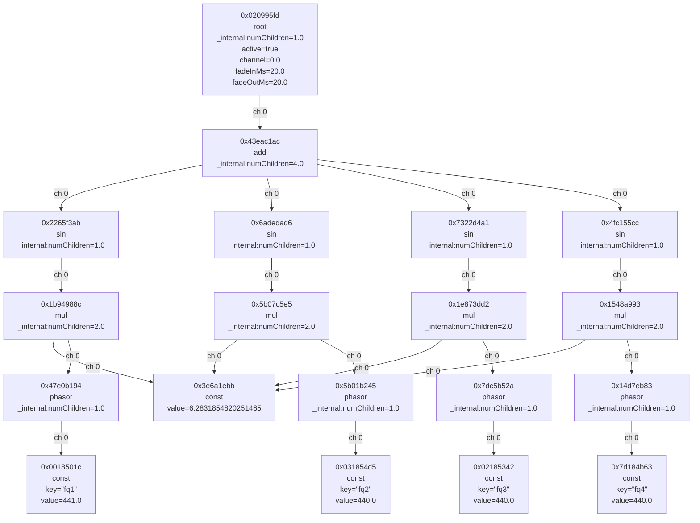

```mermaid
flowchart TD
    n0x0018501c["0x0018501c<br/>const<br/>key=#quot;fq1#quot;<br/>value=441.0"]
    n0x020995fd["0x020995fd<br/>root<br/>_internal:numChildren=1.0<br/>active=true<br/>channel=0.0<br/>fadeInMs=20.0<br/>fadeOutMs=20.0"]
    n0x02185342["0x02185342<br/>const<br/>key=#quot;fq3#quot;<br/>value=440.0"]
    n0x031854d5["0x031854d5<br/>const<br/>key=#quot;fq2#quot;<br/>value=440.0"]
    n0x14d7eb83["0x14d7eb83<br/>phasor<br/>_internal:numChildren=1.0"]
    n0x1548a993["0x1548a993<br/>mul<br/>_internal:numChildren=2.0"]
    n0x1b94988c["0x1b94988c<br/>mul<br/>_internal:numChildren=2.0"]
    n0x1e873dd2["0x1e873dd2<br/>mul<br/>_internal:numChildren=2.0"]
    n0x2265f3ab["0x2265f3ab<br/>sin<br/>_internal:numChildren=1.0"]
    n0x3e6a1ebb["0x3e6a1ebb<br/>const<br/>value=6.2831854820251465"]
    n0x43eac1ac["0x43eac1ac<br/>add<br/>_internal:numChildren=4.0"]
    n0x47e0b194["0x47e0b194<br/>phasor<br/>_internal:numChildren=1.0"]
    n0x4fc155cc["0x4fc155cc<br/>sin<br/>_internal:numChildren=1.0"]
    n0x5b01b245["0x5b01b245<br/>phasor<br/>_internal:numChildren=1.0"]
    n0x5b07c5e5["0x5b07c5e5<br/>mul<br/>_internal:numChildren=2.0"]
    n0x6adedad6["0x6adedad6<br/>sin<br/>_internal:numChildren=1.0"]
    n0x7322d4a1["0x7322d4a1<br/>sin<br/>_internal:numChildren=1.0"]
    n0x7d184b63["0x7d184b63<br/>const<br/>key=#quot;fq4#quot;<br/>value=440.0"]
    n0x7dc5b52a["0x7dc5b52a<br/>phasor<br/>_internal:numChildren=1.0"]
    n0x020995fd -->|ch 0| n0x43eac1ac
    n0x14d7eb83 -->|ch 0| n0x7d184b63
    n0x1548a993 -->|ch 0| n0x3e6a1ebb
    n0x1548a993 -->|ch 0| n0x14d7eb83
    n0x1b94988c -->|ch 0| n0x3e6a1ebb
    n0x1b94988c -->|ch 0| n0x47e0b194
    n0x1e873dd2 -->|ch 0| n0x3e6a1ebb
    n0x1e873dd2 -->|ch 0| n0x7dc5b52a
    n0x2265f3ab -->|ch 0| n0x1b94988c
    n0x43eac1ac -->|ch 0| n0x2265f3ab
    n0x43eac1ac -->|ch 0| n0x6adedad6
    n0x43eac1ac -->|ch 0| n0x7322d4a1
    n0x43eac1ac -->|ch 0| n0x4fc155cc
    n0x47e0b194 -->|ch 0| n0x0018501c
    n0x4fc155cc -->|ch 0| n0x1548a993
    n0x5b01b245 -->|ch 0| n0x031854d5
    n0x5b07c5e5 -->|ch 0| n0x3e6a1ebb
    n0x5b07c5e5 -->|ch 0| n0x5b01b245
    n0x6adedad6 -->|ch 0| n0x5b07c5e5
    n0x7322d4a1 -->|ch 0| n0x1e873dd2
    n0x7dc5b52a -->|ch 0| n0x02185342
```
