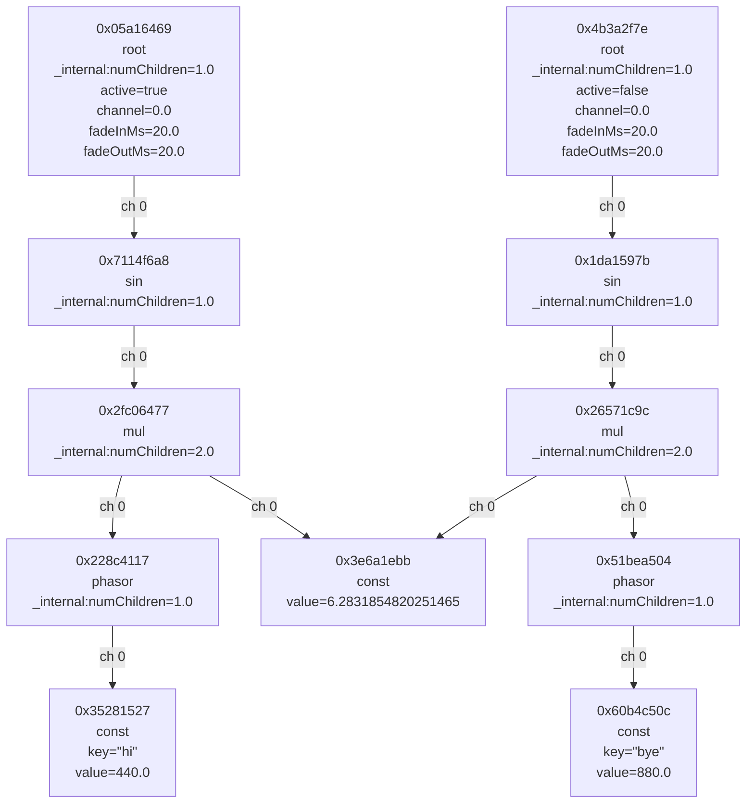

```mermaid
flowchart TD
    n0x05a16469["0x05a16469<br/>root<br/>_internal:numChildren=1.0<br/>active=true<br/>channel=0.0<br/>fadeInMs=20.0<br/>fadeOutMs=20.0"]
    n0x1da1597b["0x1da1597b<br/>sin<br/>_internal:numChildren=1.0"]
    n0x228c4117["0x228c4117<br/>phasor<br/>_internal:numChildren=1.0"]
    n0x26571c9c["0x26571c9c<br/>mul<br/>_internal:numChildren=2.0"]
    n0x2fc06477["0x2fc06477<br/>mul<br/>_internal:numChildren=2.0"]
    n0x35281527["0x35281527<br/>const<br/>key=#quot;hi#quot;<br/>value=440.0"]
    n0x3e6a1ebb["0x3e6a1ebb<br/>const<br/>value=6.2831854820251465"]
    n0x4b3a2f7e["0x4b3a2f7e<br/>root<br/>_internal:numChildren=1.0<br/>active=false<br/>channel=0.0<br/>fadeInMs=20.0<br/>fadeOutMs=20.0"]
    n0x51bea504["0x51bea504<br/>phasor<br/>_internal:numChildren=1.0"]
    n0x60b4c50c["0x60b4c50c<br/>const<br/>key=#quot;bye#quot;<br/>value=880.0"]
    n0x7114f6a8["0x7114f6a8<br/>sin<br/>_internal:numChildren=1.0"]
    n0x05a16469 -->|ch 0| n0x7114f6a8
    n0x1da1597b -->|ch 0| n0x26571c9c
    n0x228c4117 -->|ch 0| n0x35281527
    n0x26571c9c -->|ch 0| n0x3e6a1ebb
    n0x26571c9c -->|ch 0| n0x51bea504
    n0x2fc06477 -->|ch 0| n0x3e6a1ebb
    n0x2fc06477 -->|ch 0| n0x228c4117
    n0x4b3a2f7e -->|ch 0| n0x1da1597b
    n0x51bea504 -->|ch 0| n0x60b4c50c
    n0x7114f6a8 -->|ch 0| n0x2fc06477
```
